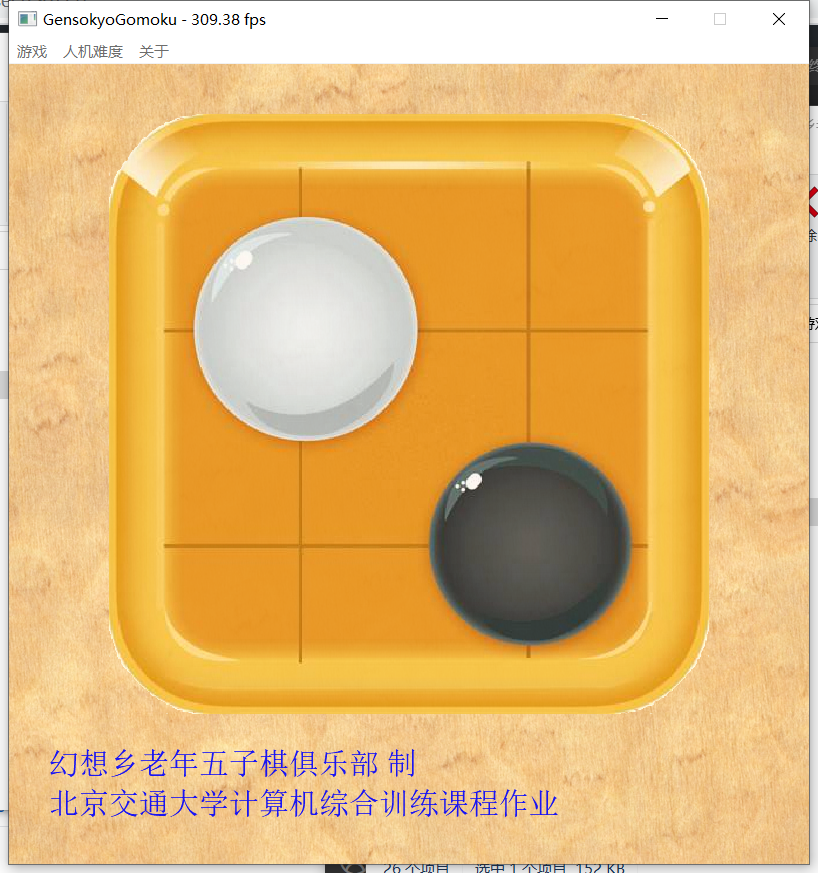
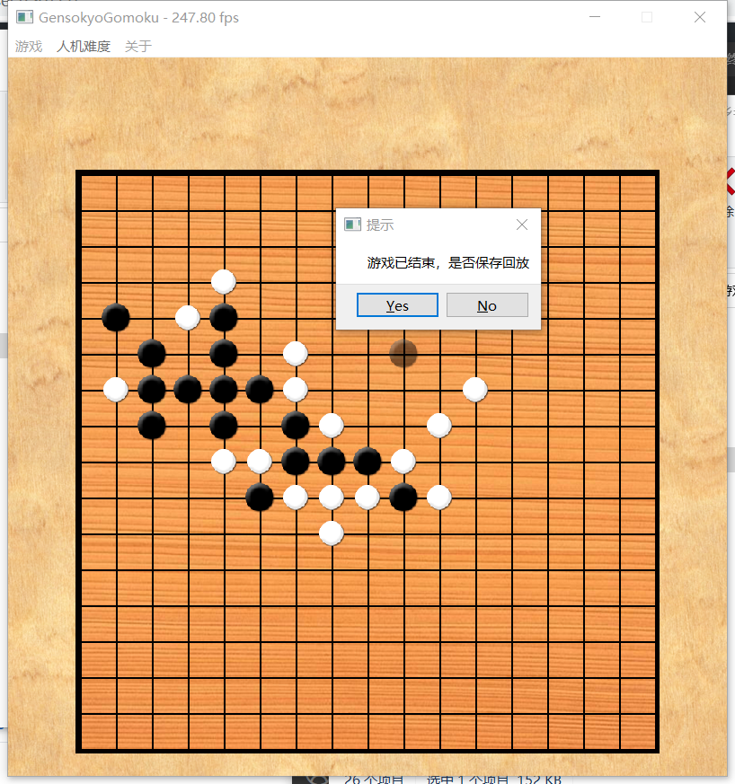

# GensokyoGomoku
北京交通大学计算机综合训练

五子棋游戏，主要特性：

- 图形化界面
- 基于博弈树+Alpha-Beta搜索的AI决策
- 局域网联机对战

下载地址: <a href="https://github.com/sxysxy/GensokyoGomoku/releases/tag/1.0">Release Page</a>

代码使用C++语言写成，在Windows平台上Visual Studio 2019 IDE编译(见后“代码简要说明”，“编译代码注意事项”)。

## 截图Show

## 代码简要说明

- 使用Qt构建的图形界面(窗口，菜单等)，游戏主界面内部图形界面自绘实现。
- 使用协程(Coroutine)组织游戏“并行”逻辑，协程调用系统API实现了非对称协程，见Coroutine.h/.cpp和AnimationProc.h/.cpp。
- AI模块,基于博弈树+Alpha-Beta搜索实现，在BotZone上得分约1900分，见GomokuAI.h。

## 编译代码注意事项：

- C++语言标准C++14及以上
- 第三方库需要: Qt5(5.9), SDL2, SDL2_image, SDL2_net
- 协程的Coroutine实现依赖Windows平台的Windows.h，移植到*nix平台时应注意
